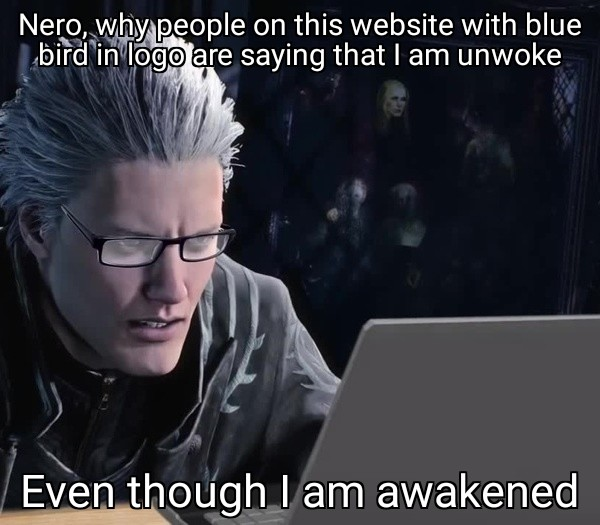

# Hi there, I'm Chris Su 👋

<p align="center"></p>


## About Me 

```yaml
---
apiVersion: api.slchris.github.io/v1alpha1
kind: Bio
metadata:
  name: about-me
  labels:
    app: about-me
  annotations:
    api.slchris.github.io/full-name: Chris Su
    api.slchris.github.io/career:  I'm a DevOps Engineer, and a student of psychology at Beijing Normal University
    api.slchris.github.io/roles: Community Blogger, Cloud Solution Architect, DevOps Specialist, Security Specialist
    api.slchris.github.io/community: @hbs, @gentoo, and @bnu
    api.slchris.github.io/website: https://slchris.github.io
    api.slchris.github.io/goal: Contribute projects globally
    api.slchris.github.io/fun-fact: Neovim Amateur desu~
spec:
  certifications:

  - [x] PMP
  - [x] RHCE
  - [x] ITIL
  languanges:
  - Native in Chinese
  - Newbie in English
  skills:
  - AWS, GCP, Oracle Cloud, Proxmox VE, VMware, AliCloud
  - Linux, NAS, Containerization, Kubernetes, Networking, Security, DevSecOps, GitOps, Serverless, Automation
  - Technical Writing, Public Speaking, Advocacy and Outreach, Host Events
  - BigData, CDH, HDP, Spark, HDFS
```